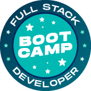

  

# IGTI - Bootcamp FullStack (Maio-2020)

## Linguagens, ferramentas e tecnologias trabalhadas: :computer:

<ul>
  <li> HTML, CSS e JavaScript </li>
  <li> Node.js e Express </li>
  <li> Insomnia e mLab </li>
  <li> React.js </li>
  <li> MongoDB </li>
  <li> Git e Heroku </li>
</ul>

#### Cada módulo será dividido em duas semanas, sendo a primeira para desenvolvimento do conteúdo prático, e a segunda para entrega do desafio. :rocket:

## Módulos do Bootcamp: :pencil:

<h3> Módulo 1 - Fundamentos </h3>
<ul list-style="none">
  <li> Introdução, instalação e configuração do Visual Studio Code (VSCode). </li>
  <li> Instalação do Node.js. Instalação da biblioteca live-server. </li>
  <li> Noções de HTML e CSS. Introdução ao JavaScript. Integração do JavaScript com o
  HTML e CSS. JavaScript básico – console, comentários, tipos primitivos, variáveis, API’s
  nativas de servidor e web, funções, estruturas de decisão, estruturas de repetição,
  manipulação de eventos. </li>
</ul>

  <a href="https://github.com/walldba/IGTI-BootcampFullstack/tree/master/Modulo1/TP1">Trabalho Prático</a> | <a href="https://github.com/walldba/IGTI-BootcampFullstack/tree/master/Modulo1/DM1">Desafio Final</a>

<h3> Módulo 2 - Desenvolvimento de API’s </h3>
<ul list-style="none">
  <li> Introdução ao desenvolvimento backend. Backend x frontend. Introdução ao
  desenvolvimento de APIs. Introdução ao desenvolvimento com Node. js. </li>
  <li> Introdução ao Express. Criação de requisições HTTP, rotas e middlewares com Express. </li>
  <li> Introdução à ferramenta Insomnia. Construção de APIs HTTP, utilizando as principais
  operações: GET, POST, PUT, e DELETE. </li>
  <li> Desenvolvimento das operações CRUD.Persistência de Dados em Arquivos. </li>
</ul>

  <a href="https://github.com/walldba/IGTI-BootcampFullstack/tree/master/Modulo2/TP2">Trabalho Prático</a> | <a href="https://github.com/walldba/IGTI-BootcampFullstack/tree/master/Modulo2/DM2">Desafio Final</a>

<h3> Módulo 3 - FrontEnd com React </h3>
<ul list-style="none">
 <li> Instalação e configuração do React. Criação de projetos com o create-react-app. </li>
 <li> Introdução ao React – JSX, Componentes de Funções, Componentes de Classe. </li>
 <li> State, Props, Binding, Interpolação. </li>
 <li> Comunicação entre componentes. Ciclo de vida de componentes de classe. Introdução
  às requisições HTTP com React. </li>
 <li> Roteamento com react-router. Introdução ao Ionic React. </li>
 <li> Criação de um pequeno projeto passo-a-passo com React </li>
</ul>

  <a href="https://github.com/walldba/IGTI-BootcampFullstack/tree/master/Modulo3/TP3">Trabalho Prático</a> | <a href="https://github.com/walldba/IGTI-BootcampFullstack/tree/master/Modulo3/DM3">Desafio Final</a>

<h3> Módulo 4 - Persistência de dados, versionamento de código e implantação </h3>
<ul list-style:none>
  <li> Introdução ao MongoDB. Utilização do serviço mLab. Integrando a API ao MongoDB no
  mLab. </li>
  <li> Introdução ao Git. Instalação do git. Principais comandos do Git. </li>
  <li> Como publicar aplicações no Github. Introdução ao Heroku. Instalação do Heroku CLI. </li>
  <li> Como implantar aplicações no Heroku. </li>
 </ul>

<h3> Módulo 5 - Fechamento </h3>
<ul list-style="none">
  <li> Entrega do Desafio Final. </li>
</ul>

<h2> Duração do Bootcamp :clock1: </h2>

Cerca de 2 meses e meio, totalizando 148 horas. 
